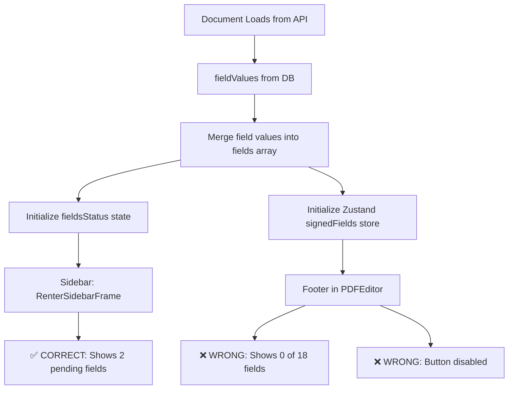

# PDF Signing Data Flow Analysis

## Problem Summary
- **Sidebar**: ✅ Shows correct data (2 pending signature/initial fields)
- **Footer**: ❌ Shows "0 of 18 fields" (should be "0 of 2 fields")
- **Next Action Button**: ❌ Disabled (should be enabled since there are unsigned fields)

## Data Flow Diagram



## Component Data Sources

### 1. Sidebar (RenterSidebarFrame) - ✅ WORKING

**Data Source**: `fieldsStatus` prop from lease-signing-client.tsx

```javascript
// lease-signing-client.tsx lines 182-197
fields.forEach((field) => {
  const isSigned = (field.value && field.signedAt);
  initialFieldsStatus[field.formId] = isSigned ? 'signed' : 'pending';
});
setFieldsStatus(initialFieldsStatus);

// Passed to sidebar as prop
<RenterSidebarFrame 
  fieldsStatus={fieldsStatus}  // ← Uses state variable
  ...
/>
```

**How it counts**:
```javascript
// renter-sidebar-frame.tsx lines 54-58
const signatureFields = tenantFields.filter(field => {
  const fieldType = typeof field.type === 'string' ? field.type : (field.type?.type || field.type?.value || '');
  return ['SIGNATURE', 'INITIALS'].includes(fieldType);
});
const completedFields = signatureFields.filter(field => fieldsStatus[field.formId] === 'signed');
```

**Result**: Correctly shows 0/2 (0 signed out of 2 signature/initial fields)

### 2. Footer (PDFEditor) - ❌ BROKEN

**Data Source**: Zustand store `useSignedFieldsStore`

```javascript
// PDFEditor.tsx - Footer field counting
const signerFields = workflowState === 'signer2' 
  ? fields.filter(f => {
      if (f.recipientIndex === 1) {  // Renter's fields
        const fieldType = typeof f.type === 'string' ? f.type : (f.type?.type || f.type?.value || '');
        return fieldType === 'SIGNATURE' || fieldType === 'INITIALS';
      }
      return false;
    })
  : fields.filter(f => f.recipientIndex === currentSignerIndex);

// Button disabled check
const unsignedFields = getUnsignedFields(useSignedFieldsStore.getState().signedFields);
disabled={unsignedFields.length === 0}
```

**The getUnsignedFields function**:
```javascript
const getUnsignedFields = (currentSignedFields) => {
  const currentSignerIndex = workflowState === 'signer1' ? 0 : 1;
  const allSignatureFields = fields.filter(f => {
    if (f.recipientIndex !== currentSignerIndex) return false;
    const fieldType = typeof f.type === 'string' ? f.type : (f.type?.type || f.type?.value || '');
    return fieldType === 'SIGNATURE' || fieldType === 'INITIALS';
  });
  
  const unsignedFields = allSignatureFields.filter(field => {
    const value = currentSignedFields[field.formId];
    const hasValue = value !== undefined && value !== null && value !== '';
    return !hasValue;  // ← Returns true for ALL fields because Zustand is empty!
  });
  
  return unsignedFields;
};
```

## The Root Cause

### Problem 1: Zustand Store Not Properly Initialized

**Current code** (lease-signing-client.tsx lines 128-141):
```javascript
fields = fields.map((field) => {
  const fieldValue = fieldValuesMap.get(field.formId);
  
  // Merge ALL field values (including host's) so we know what's already signed
  if (fieldValue) {
    return {
      ...field,
      value: fieldValue.value,
      signedAt: fieldValue.signedAt,
      signerIndex: fieldValue.signerIndex
    };
  }
  return field;
});
```

**Then** (lines 183-202):
```javascript
const signedFieldsMap = {};
fields.forEach((field) => {
  const isSigned = (field.value && field.signedAt);
  if (isSigned) {
    signedFieldsMap[field.formId] = field.value;  // ← This should include host's fields!
  }
});
initializeSignedFields(signedFieldsMap);
```

### Problem 2: Footer Shows Wrong Total Count

The footer shows "0 of 18" instead of "0 of 2" because:

1. It correctly filters to 2 fields for counting (SIGNATURE/INITIALS for recipientIndex=1)
2. BUT somewhere it's using the total field count (18) instead of the filtered count (2)

### Problem 3: Button Disabled Logic

The button is disabled because:
```javascript
getUnsignedFields(useSignedFieldsStore.getState().signedFields).length === 0
```

Since Zustand store is empty/wrong, ALL fields appear unsigned, but then it filters to only renter's fields... wait, that should return 2 unsigned fields and enable the button. Let me check...

## Why The Fix Didn't Work

The fix attempted to merge ALL field values, but the issue is likely that:

1. **Host's fields (recipientIndex=0)** come from `fieldValues` table with `signerIndex=0`
2. **Renter's fields (recipientIndex=1)** should be unsigned initially
3. But the Zustand store might not be getting the host's fields properly initialized

The real issue might be that `fieldValuesMap` only contains values for fields that have been signed, but we're not checking the right signer index.

## The Solutions Applied

### Fix 1: Include ALL signed fields in Zustand initialization
Changed the field merging to include ALL signed fields (including host's) so Zustand knows what's already signed:
```javascript
// Now merges ALL field values, not just current user's
if (fieldValue) {
  return {
    ...field,
    value: fieldValue.value,
    signedAt: fieldValue.signedAt,
    signerIndex: fieldValue.signerIndex
  };
}
```

### Fix 2: Remove duplicate footer during signing
The lease-signing-client.tsx had its own footer that was showing during signing mode with:
- Wrong count: "0 of 18 fields" (counting ALL fields instead of just renter's 2)  
- Disabled button that did nothing

Solution: Only show lease-signing-client footer for `overview-lease` and `completed` states. Let PDFEditor's footer handle the `sign-lease` state.

### Fix 3: Added extensive debugging
Added console logs to track:
- What fields are loaded from the database
- What gets added to Zustand store
- Verification that Zustand is properly initialized

## Expected Result After Fixes

1. **Zustand store** will be initialized with host's signed fields
2. **PDFEditor footer** will:
   - Count only renter's 2 SIGNATURE/INITIALS fields
   - Show "0 of 2 fields completed"
   - Have "Next Action" button enabled (since there are unsigned fields)
3. **No duplicate footer** from lease-signing-client during signing