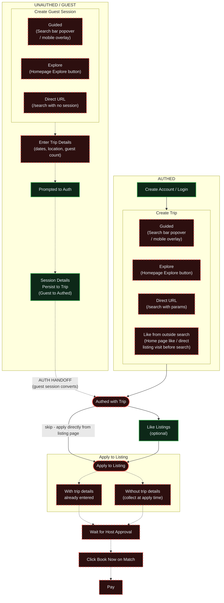

# Renter Flow - E2E Test Coverage

Solid lines = tested. Dashed lines = untested.

## Coverage Summary

| Step | Branch | Tested | Test File(s) | Notes |
|------|--------|--------|--------------|-------|
| Create Account / Login | Authed | ✅ | auth-flow.spec.ts | |
| Create Trip — Guided (popover / mobile overlay) | Authed | ❌ | — | |
| Create Trip — Explore button | Authed | ❌ | — | |
| Create Trip — Direct URL | Authed | ❌ | — | |
| Create Trip — Like from outside search | Authed | ❌ | — | Home page like, direct listing visit |
| Create Guest Session — Guided (popover / mobile overlay) | Guest | ❌ | — | |
| Create Guest Session — Explore button | Guest | ❌ | — | |
| Create Guest Session — Direct URL | Guest | ❌ | — | Must create session before apply |
| Enter Trip Details | Guest | ❌ | — | |
| Prompted to Auth | Guest | ✅ | guest-likes.spec.ts | Auth modal on heart click tested |
| Session Details Persist to Trip (Guest → Authed) | Guest | ✅ | guest-likes.spec.ts | |
| Like Listings (optional) | Both (authed) | ✅ | guest-likes.spec.ts | Can skip — apply directly from listing page |
| Apply to Listing — with trip details | Both | ❌ | — | Happy path |
| Apply to Listing — without trip details | Both | ❌ | — | Details collected inline at apply time |
| Wait for Host Approval | Both | ❌ | — | Host side |
| Click "Book Now" on Match | Both | ❌ | — | |
| Pay | Both | ❌ | — | |
