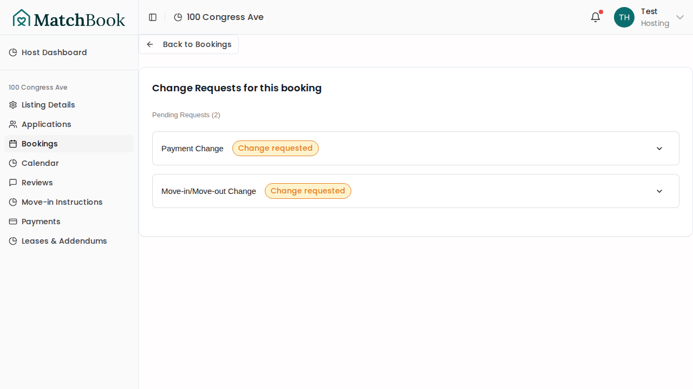
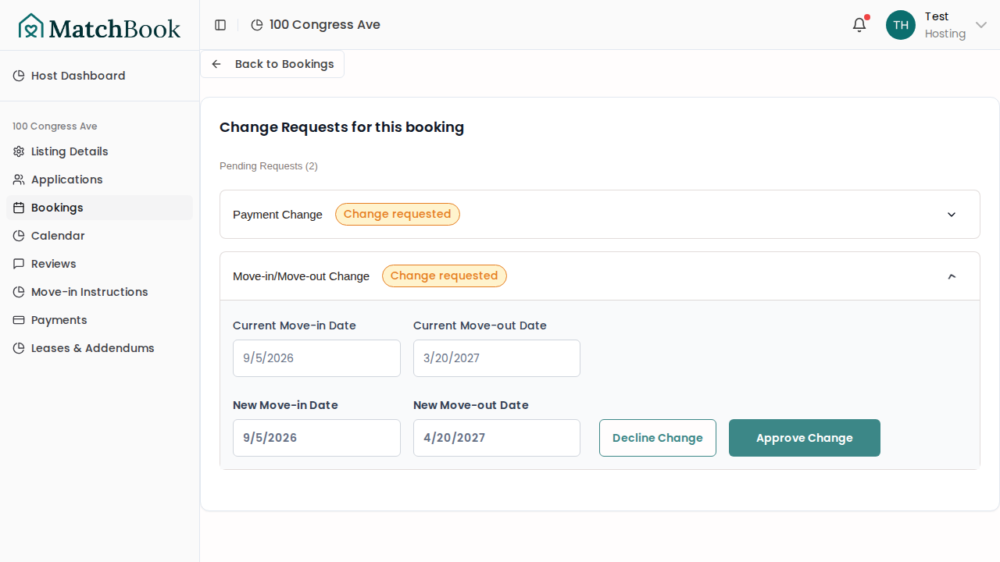
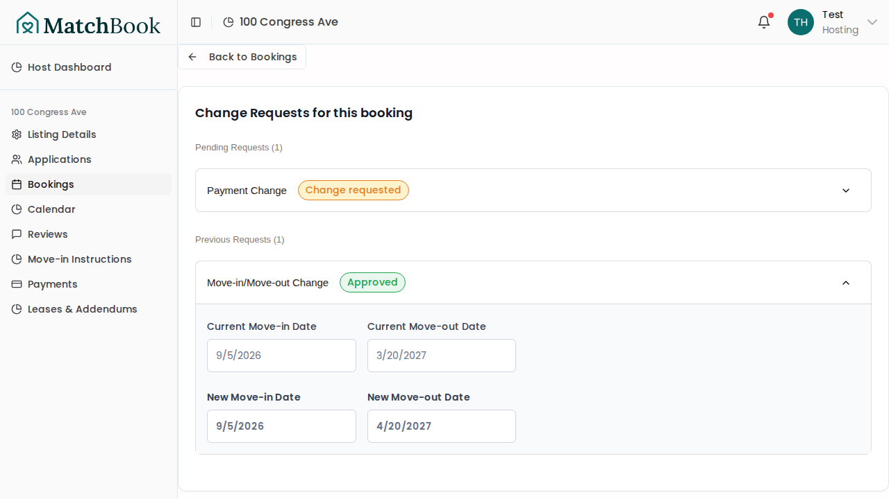
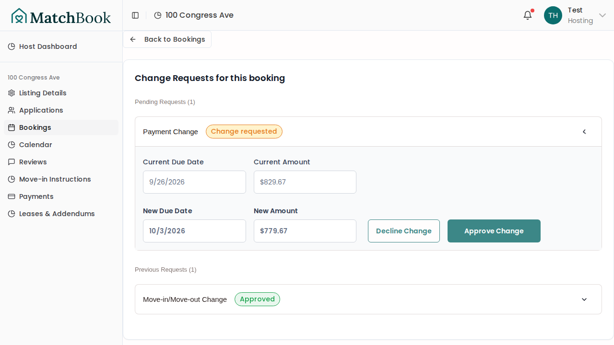
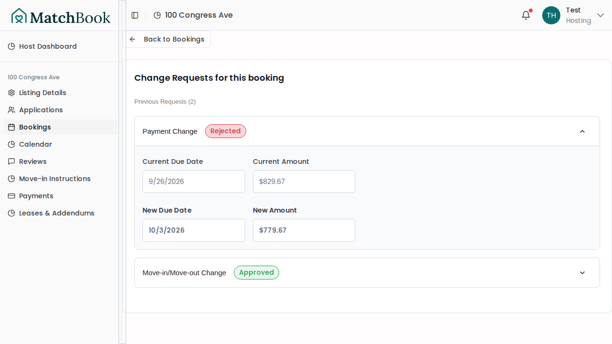

# Booking Modifications — Host Approval & Rejection

**Feature:** Host can approve or reject booking date changes and payment modifications requested by renters.

**Bug fixes discovered during testing:**
- `booking-modifications.ts` referenced `booking.listing.monthlyRent` but `monthlyRent` lives on the Booking model, not Listing. Fixed to `booking.monthlyRent ?? 0`.
- `payment-modifications.ts` had all three `createNotification` calls using wrong field names (`title`, `message`, `type`, `metadata` instead of `content`, `url`, `actionType`, `actionId`). Fixed all three notification calls (create, approve, reject).

---

## Flow

```
Renter requests modification → notification sent to host
→ Host opens changes page → sees pending request
→ Host expands request → reviews details
→ Host clicks Approve/Decline → status updated, notification sent to renter
```

---

## Desktop Flow

### Step 1: Pending requests overview

Host navigates to the booking changes page. Pending date change and payment change requests are visible, collapsed by default.



### Step 2: Date change details expanded

Host clicks a "Move-in/Move-out Change" card to see the original and proposed dates, along with the reason for the request.



### Step 3: Date change approved

Host clicks "Approve Change". The server action updates the booking dates, recalculates rent payments, and sends a notification email to the renter. The card shows an "Approved" badge.



### Step 4: Payment change details expanded

Host clicks a "Payment Change" card to see the original and proposed amount and due date.



### Step 5: Payment change declined

Host clicks "Decline Change". The modification is rejected and the renter is notified. The card shows a "Rejected" badge.



---

## Mobile Flow

### Step 1: Pending requests overview

On mobile, the changes page displays in a single-column layout with collapsible cards.


### Step 2: Date change details expanded

The date change details expand inline with approve/decline buttons stacked vertically.


### Step 3: Date change approved

After approval, the card moves to the resolved section with an "Approved" badge.


### Step 4: Payment change details expanded

Payment modification details show the original and proposed amounts and due dates.


### Step 5: Payment change declined

The declined payment modification shows a "Rejected" badge and the original payment remains unchanged.


---

## Test Coverage

| Test | File | Description |
|------|------|-------------|
| Find active booking for host | `booking-modifications.spec.ts` | Setup: resolves booking and notification user via Prisma |
| Host can approve a booking date change | `booking-modifications.spec.ts` | Creates date change fixture, host approves, verifies DB |
| Host can reject a booking date change | `booking-modifications.spec.ts` | Creates date change fixture, host rejects, verifies DB |
| Host can approve a payment modification | `booking-modifications.spec.ts` | Creates payment mod fixture, host approves, verifies DB |
| Host can reject a payment modification | `booking-modifications.spec.ts` | Creates payment mod fixture, host rejects, verifies DB |

## Files Changed

- `src/app/actions/booking-modifications.ts` — fixed `monthlyRent` field reference (was on Listing, moved to Booking)
- `src/app/actions/payment-modifications.ts` — fixed all 3 `createNotification` calls with correct Notification schema fields
- `e2e/booking-modifications.spec.ts` — new e2e test for host approval/rejection of both modification types
- `e2e/helpers/booking-modifications.ts` — Prisma fixture helpers for creating test modifications
- `e2e/helpers/index.ts` — exported new booking-modifications helper module
