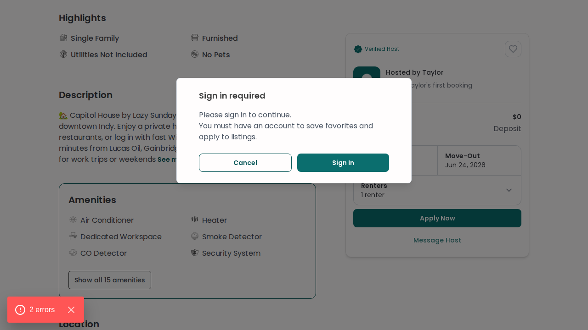
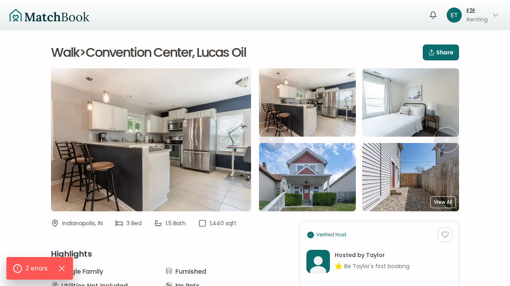
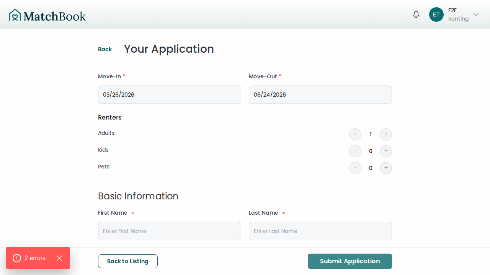
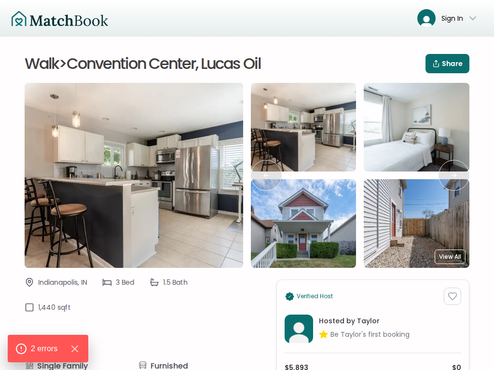
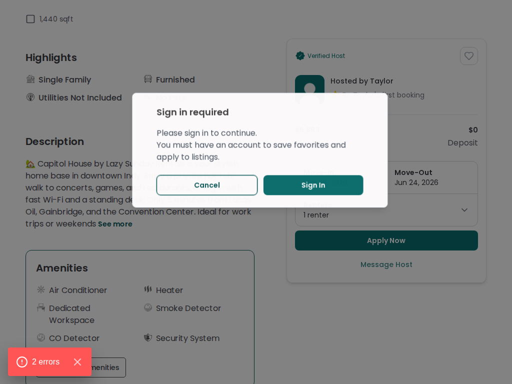
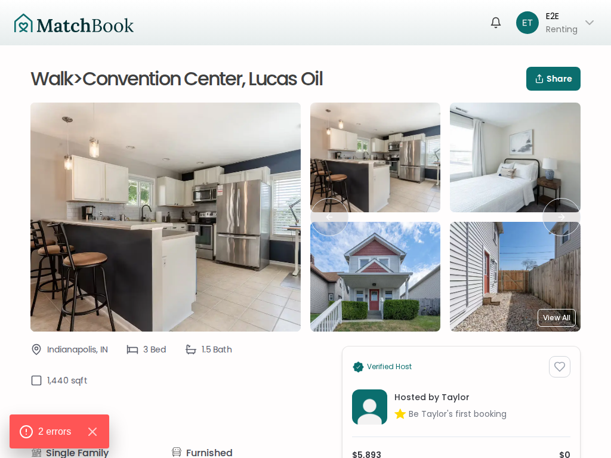
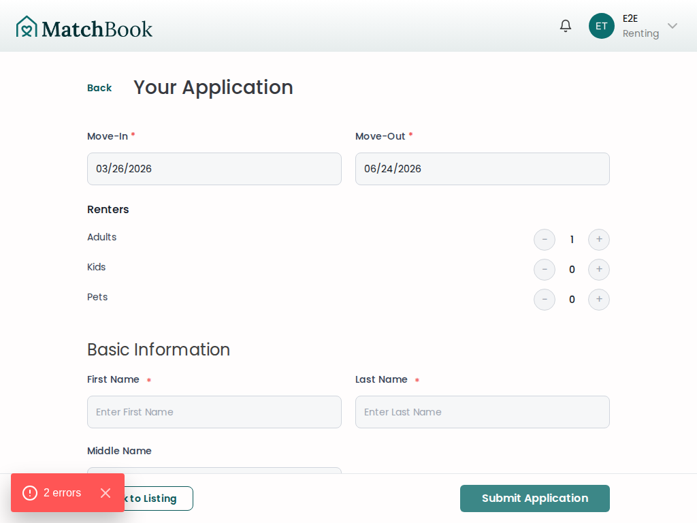
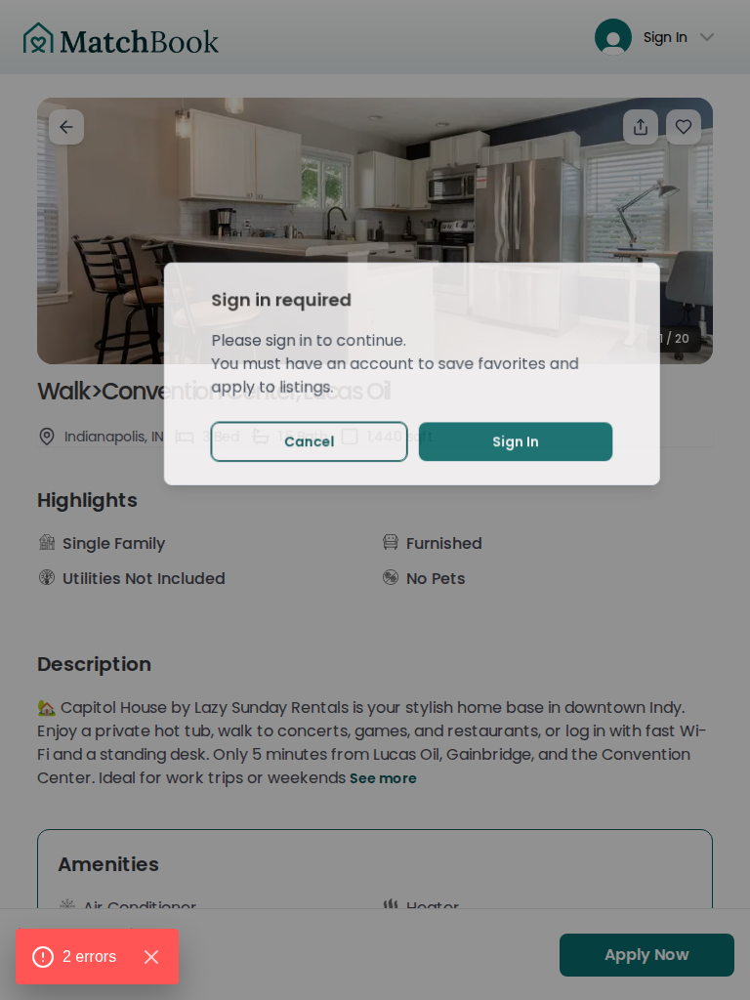
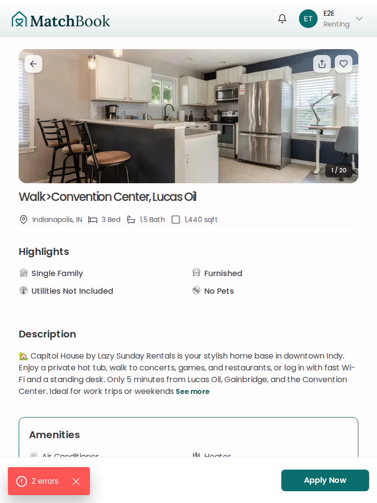
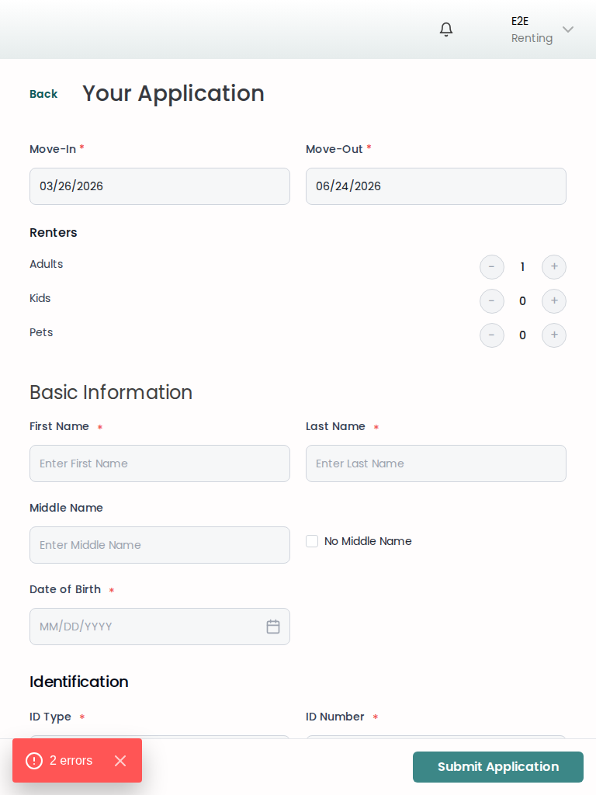

# Edge Case: Auth Redirect Preserves Trip Details

**Bug report:** When a guest fills out dates on a listing and clicks "Apply Now", they are prompted to sign in. After signing in, they are redirected back to the listing but the dates are lost and no trip is created.

**Fix:** The listing page now reads date/guest params from the URL after auth redirect, creates a trip server-side, pre-fills the action box, and auto-opens the application wizard when `isApplying=true`.

---

## Flow

```
Guest visits listing → fills dates → clicks Apply Now → auth modal → signs in
→ Clerk redirects back with ?startDate=...&endDate=...&numAdults=1&isApplying=true
→ Server creates trip → dates pre-filled → application wizard opens automatically
```

---

## Desktop Flow

### Step 1: Guest views listing with dates pre-filled

A guest (not signed in) arrives at a listing page with date parameters in the URL. The action box shows the dates and an **Apply Now** button.


### Step 2: Guest clicks "Apply Now" — auth modal appears

Since the user is not authenticated, clicking **Apply Now** triggers the auth modal. The redirect URL encodes the current dates, guest count, and `isApplying=true` so they survive the sign-in round-trip.



### Step 3: After sign-in — dates are preserved

After signing in, the user is redirected back to the listing. The dates and renter count are restored from the URL params. A trip is created server-side. The **Apply Now** button is ready.



### Step 4: Auto-apply — application wizard opens

When the redirect URL includes `isApplying=true`, the page skips straight to the application wizard with all details pre-filled (move-in, move-out, renter count). The user can review and submit immediately.



---

## Mobile Flow

### Step 1: Guest views listing with dates pre-filled

On mobile, the sticky footer shows the price, dates, and an **Apply Now** button.


### Step 2: Guest clicks "Apply Now" — auth modal appears

The auth modal overlays the listing on mobile.


### Step 3: After sign-in — dates are preserved

After signing in, the mobile footer still shows the correct dates and **Apply Now**.


### Step 4: Auto-apply — application wizard opens

The application wizard renders in a mobile-friendly layout with all details pre-filled.


---

## Additional Viewports

Laptop and tablet screenshots for visual QA. Layout and interactions match desktop — these capture presentation differences only.

### Laptop (1024×768)









### Tablet (768×1024)








---

## Test Coverage

| Test | File | Description |
|------|------|-------------|
| Guest clicking Apply Now shows auth modal | `guest-browse.spec.ts` | Guest with date params clicks Apply, auth modal appears |
| Landing with date params + isApplying shows wizard | `renter-authed.spec.ts` | Authed user with date params + isApplying lands on application wizard |
| Landing with date params pre-fills dates | `renter-authed.spec.ts` | Authed user with date params sees "Apply Now" (dates pre-filled) |

## Files Changed

- `src/app/guest/listing/[listingId]/page.tsx` — reads searchParams, creates trip server-side
- `src/app/guest/listing/[listingId]/(components)/renter-listing-action-box-context.tsx` — `autoApply` prop + effect
- `src/app/guest/listing/[listingId]/(components)/public-listing-details-view.tsx` — accepts server `tripId` prop
