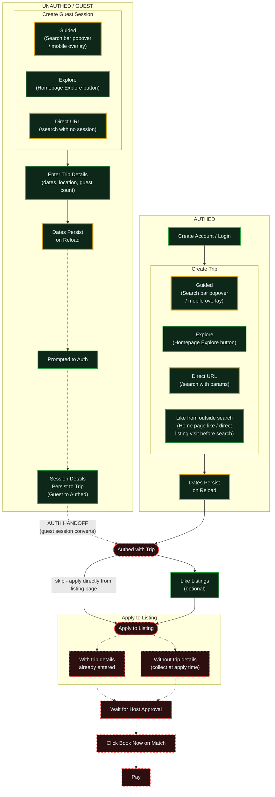
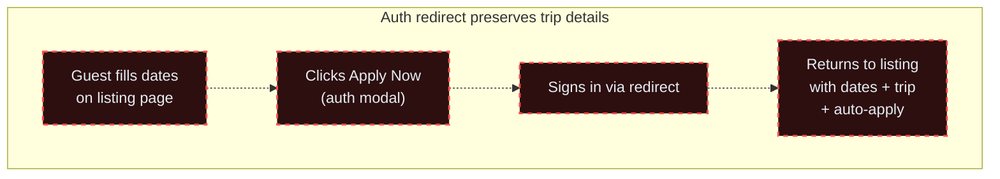

# Renter Flow - E2E Test Coverage

Solid lines = tested. Dashed lines = untested. Gold border = has mobile test.

## Edge Cases

## Coverage Summary

| Step | Branch | Tested | Mobile ★ | Test File(s) | Notes |
|------|--------|--------|----------|--------------|-------|
| Create Account / Login | Authed | ✅ | — | auth-flow.spec.ts | |
| Create Trip — Guided (popover / mobile overlay) | Authed | ✅ | ★ | renter-authed.spec.ts | Story 02a: desktop popover + mobile overlay |
| Create Trip — Explore button | Authed | ✅ | — | renter-authed.spec.ts | Story 02b: creates tripId and navigates |
| Create Trip — Direct URL | Authed | ✅ | ★ | renter-authed.spec.ts | Story 02b/02d: bare lat/lng redirects to tripId |
| Create Trip — Like from outside search | Authed | ✅ | ★ | renter-authed.spec.ts, guest-browse.spec.ts | Story 06: direct listing URL like creates trip, guest gets auth modal |
| Create Guest Session — Guided (popover / mobile overlay) | Guest | ✅ | ★ | guest-browse.spec.ts | Story 02a: desktop popover + mobile overlay |
| Create Guest Session — Explore button | Guest | ✅ | — | guest-browse.spec.ts | Story 04: creates sessionId and navigates |
| Create Guest Session — Direct URL | Guest | ✅ | ★ | guest-browse.spec.ts | Story 02b/02c: bare lat/lng redirects to sessionId |
| Enter Trip Details — Date input validation | Guest | ✅ | — | guest-browse.spec.ts | Story 02a: past date, today, end < start, < 1 month |
| Enter Trip Details — Dates + location (guided) | Guest | ✅ | — | guest-browse.spec.ts | Story 02a: covered by guided search happy path |
| Trip dates persist on reload | Authed | ✅ | ★ | renter-authed.spec.ts | Story 02a: reload after guided search, dates survive |
| Session dates persist on reload | Guest | ✅ | ★ | guest-browse.spec.ts | Story 02a: reload after guided search, dates survive |
| Prompted to Auth | Guest | ✅ | — | guest-likes.spec.ts | Auth modal on heart click tested |
| Session Details Persist to Trip (Guest → Authed) | Guest | ✅ | — | guest-likes.spec.ts | |
| Like Listings (optional) | Both (authed) | ✅ | — | guest-likes.spec.ts | Can skip — apply directly from listing page |
| **Edge: Auth redirect preserves trip details** | Guest → Authed | ❌ | — | — | Guest fills dates, clicks Apply, signs in, returns with dates + trip created + auto-apply |
| Apply to Listing — with trip details | Both | ❌ | — | — | Happy path |
| Apply to Listing — without trip details | Both | ❌ | — | — | Details collected inline at apply time |
| Wait for Host Approval | Both | ❌ | — | — | Host side |
| Click "Book Now" on Match | Both | ❌ | — | — | |
| Pay | Both | ❌ | — | — | |
